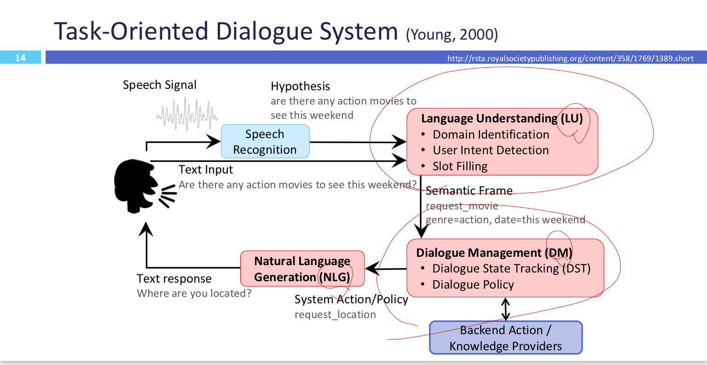

# Deep Learning For Dialogue System

## 현재 CUI ( Conversational UI )의 챌린지

1. 자연어에서의 variability
2. Robustness
3. Recall / Precision의 Trade Off 
   1. cf.) F1 score
4. Meaning Representation
5. 학습 가능성
6. 명료성

## Task Oriented Dialogue System

1. LU (Language Understanding) : 문장의 의미를 찾는 과정. 크게 DI ( Domain Indentification ), UID ( User Intent Detection ), SF ( Slot Filling 으로 나뉜다. )

   1. DI

   2. UID

   3. SF

      

2. DM ( Dialogue Management ) : 

3. NLG ( Natural Language Generation ) : 